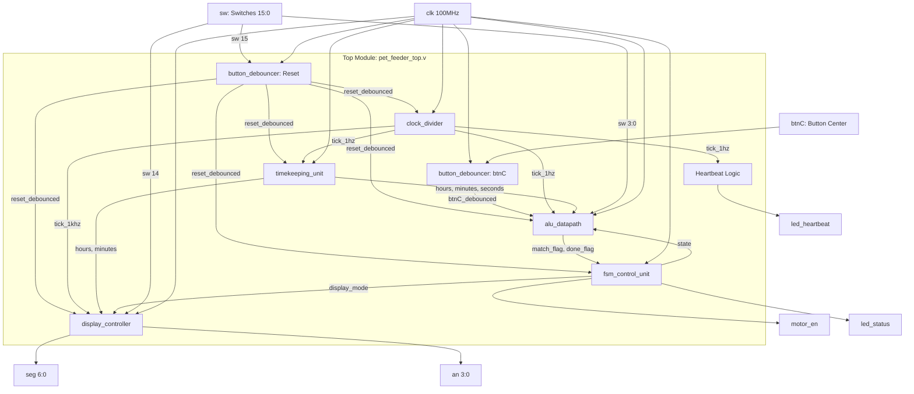
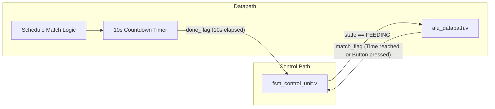
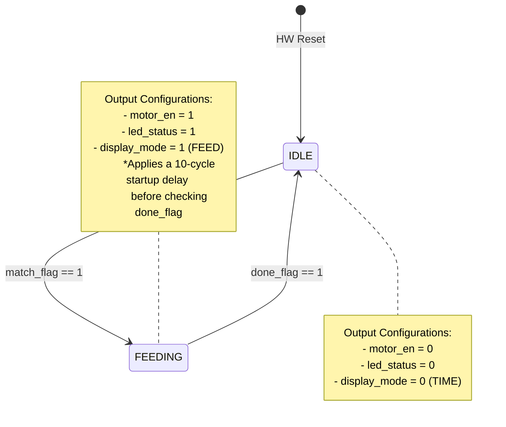
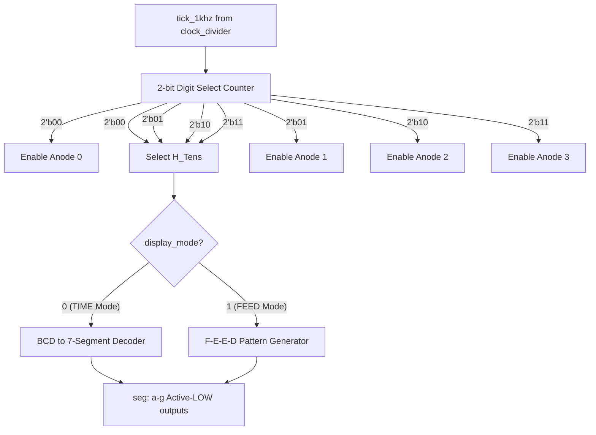
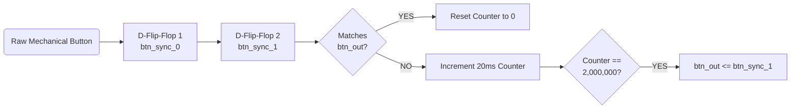

# Automated Pet Feeding Scheduler - FPGA

This project implements an Automated Pet Feeding Scheduler on a Basys 3 FPGA using Verilog HDL. It is a time-aware embedded hardware system designed to trigger a pet feeding mechanism based on pre-configured daily schedules or manual overrides.

## Tech Stack and Tools
- **Hardware Description Language**: Verilog
- **Development Environment**: Xilinx Vivado Design Suite
- **Target Hardware**: Basys 3 FPGA Board (Artix-7 XC7A35T)
- **Constraint Mapping**: XDC (Xilinx Design Constraints)
- **Simulation**: Vivado Simulator (Verilog Testbenches)

---

## Top-Level System Architecture: Hierarchical RTL (Register-Transfer Level)

---

## Micro-Architectures & Hardware Logic Flows

### 1. FSMD Architecture (Finite State Machine with Datapath)
The core logic is divided into an FSM (Control Unit) and an ALU (Datapath). The datapath evaluates time math and countdowns, while the FSM safely commands the mechanical outputs.

### 2. Moore Machine FSM Architecture
Inside `fsm_control_unit.v`, the system operates as a strict Moore machine. This ensures that the motor output relies *only* on the current state, preventing dangerous glitches or mechanical stuttering caused by input fluctuations.

### 3. Time-Division Multiplexing (TDM) Architecture
To control four 7-segment digits simultaneously while saving physical FPGA pins, `display_controller.v` multiplexes the display using the 1kHz clock tick.

### 4. Metastability & Debouncing Flow (2-Stage Synchronizer)
Mechanical buttons produce electrical "bouncing" and are completely asynchronous to the 100MHz clock. `button_debouncer.v` handles this using a 2-stage synchronizer followed by a 20ms validation counter.

---

## Module Breakdown

### 1. `pet_feeder_top.v` (Top-Level Module)
The wrapper that binds all sub-modules together.
- **Inputs**: `clk` (100MHz system clock), `btnC` (Manual feed override), `sw[15:0]` (Configuration switches).
- **Outputs**: `seg[6:0]` (7-segment segments), `an[3:0]` (7-segment anodes), `motor_en` (Signal to run feeding motor), `led_status` (Feeding active LED indicator), `led_heartbeat` (1Hz flashing LED).
- **Core Logic**: Routes signals between modules. Manages the `led_heartbeat` output which toggles every second based on `tick_1hz`.

### 2. `clock_divider.v`
Generates localized synchronous timing ticks.
- **Inputs**: `clk`, `reset`.
- **Outputs**: `tick_1hz` (1 pulse/sec), `tick_1khz` (1 pulse/ms).
- **Core Logic**: Uses a 27-bit counter to divide 100MHz to 1Hz (`DIV_1HZ = 99,999,999`) for timekeeping, and a 17-bit counter for 1kHz (`DIV_1KHZ = 99,999`) for multiplexing.

### 3. `timekeeping_unit.v`
A 24-hour digital clock.
- **Inputs**: `clk`, `reset`, `tick_1hz`.
- **Outputs**: `seconds` (0-59), `minutes` (0-59), `hours` (0-23).
- **Core Logic**: Synchronously increments seconds every `tick_1hz`. Implements sequential rollover logic (e.g., 59s -> 0s + 1m; 23:59:59 -> 00:00:00).

### 4. `alu_datapath.v` (Arithmetic & Logic Unit)
Evaluates current time against programmed feeding schedules.
- **Inputs**: `hours`, `minutes`, `seconds`, `sw` (Schedule enables), `btnC` (Debounced override), `clk`, `reset`, `tick_1hz`, `state`.
- **Outputs**: `match_flag`, `done_flag`.
- **Core Logic**:
  - Checks if time precisely matches 08:00, 12:00, 17:00, or 21:00 (down to `seconds == 0`).
  - Evaluates if the corresponding switch (`sw[0]` to `sw[3]`) is active.
  - If feeding state triggers (`state == 1`), a countdown (`feed_timer`) is set to 10 and decrements by 1 every `tick_1hz`, asserting `done_flag` at 0.

### 5. `fsm_control_unit.v` (Finite State Machine)
The central nervous system.
- **Inputs**: `clk`, `reset`, `match_flag`, `done_flag`.
- **Outputs**: `state` (0: IDLE, 1: FEEDING), `motor_en`, `led_status`, `display_mode`.
- **Core Logic**: Transitioning Moore machine handling the sequence between resting and active feeding.

### 6. `display_controller.v`
Manages the 4-digit 7-segment display logic.
- **Inputs**: `clk`, `reset`, `tick_1khz`, `hours`, `minutes`, `display_mode`, `test_mode`.
- **Outputs**: `seg[6:0]` (Active-LOW cathode segments), `an[3:0]` (Active-LOW digit anodes).
- **Core Logic**: Uses BCD modulo math to decode time, and implements a hardcoded override pattern ("F E E D") when feeding.

### 7. `button_debouncer.v`
Conditions raw mechanical switch inputs.
- **Inputs**: `clk`, `btn_in`.
- **Outputs**: `btn_out`.
- **Core Logic**: 2-stage synchronizer + 20ms steady-state counting filter.

### 8. `tb_pet_feeder.v` (Simulation Testbench)
- Simulates clock generation and hardware resets.
- Downscales timing parameters (`DIV_1HZ`, `DIV_1KHZ`) to compress real-world time in simulations.
- Uses hierarchical reference to fast-forward the clock (e.g., `uut.timekeeper.hours = 7`) and validates boundary conditions like midnight rollover.

---

## I/O Mapping & Constraints (Basys3_Master.xdc)
- **Clock**: `W5` (100MHz base)
- **Switches (Inputs)**:
  - `V17, V16, W16, W17` (SW0-SW3): Schedule Toggles
  - `T1` (SW14): Display Self-Test mode
  - `R2` (SW15): Hardware System Reset
- **Buttons (Inputs)**: `U18` (Center Button - Manual Override)
- **7-Segment Display (Outputs)**:
  - Segments A-G: `W7, W6, U8, V8, U5, V5, U7`
  - Anodes 0-3: `U2, U4, V4, W4`
- **LEDs / Motor (Outputs)**:
  - `U16` (LED 0): LED Status (Feeding active)
  - `L1` (LED 15): Motor Enable out-pin
  - `V19` (LED 1): 1Hz Clock Heartbeat
